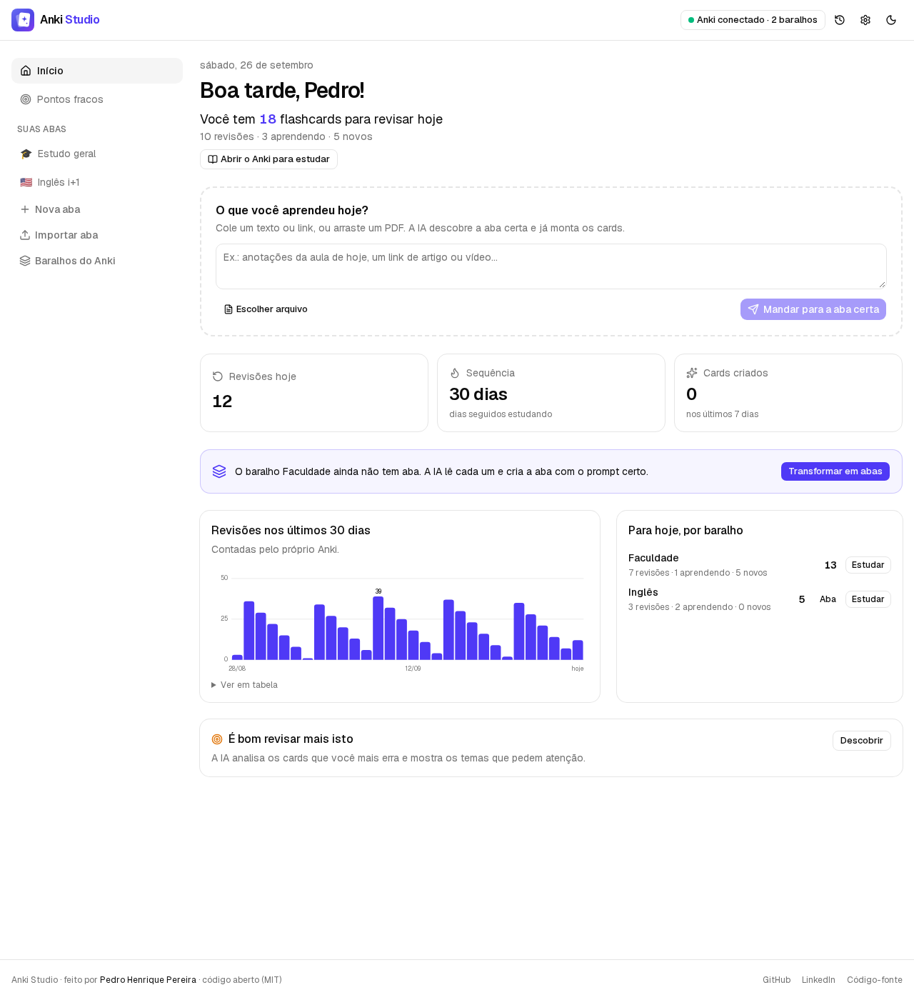
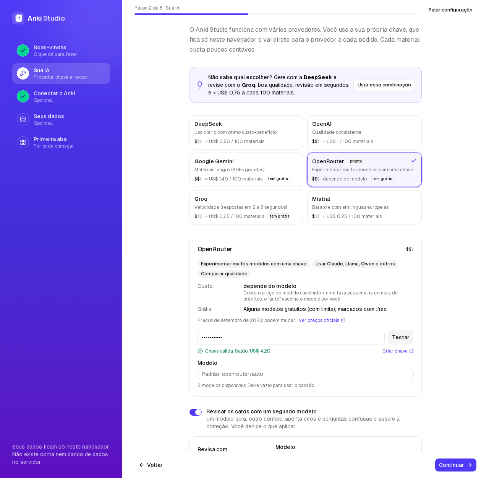
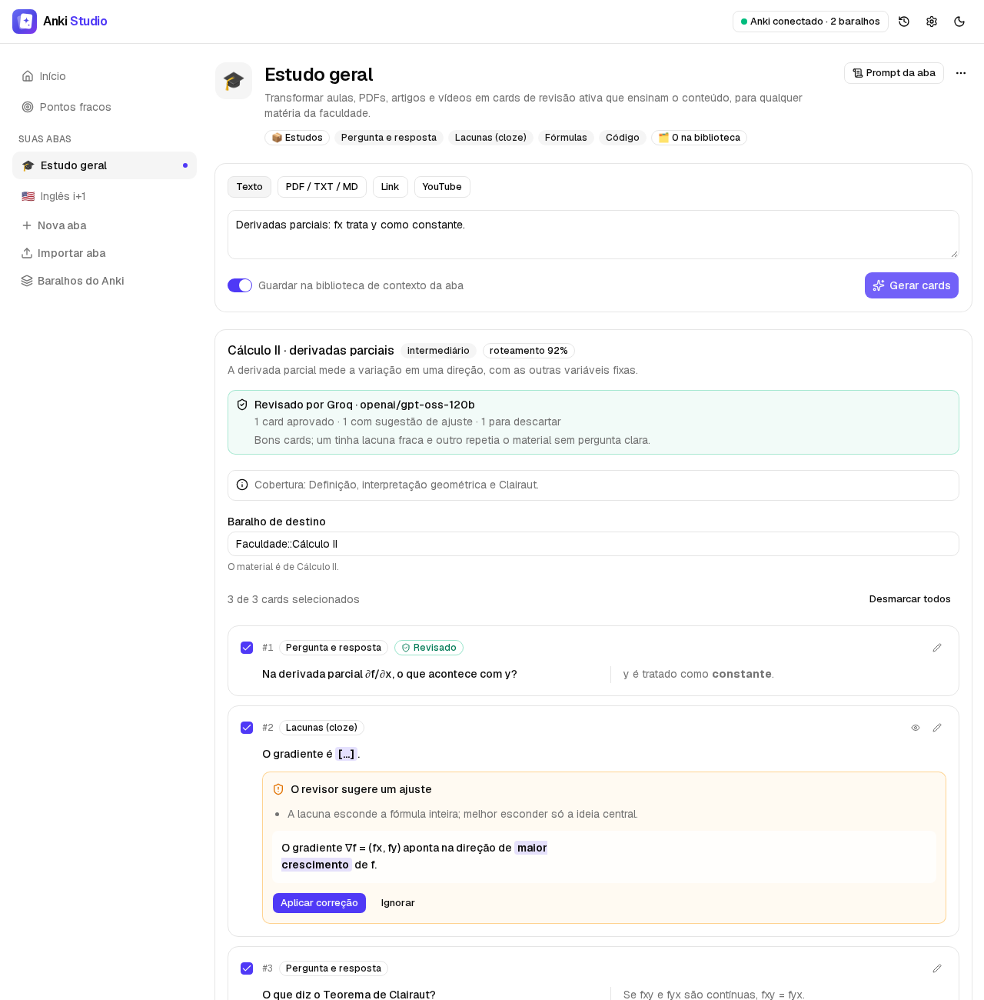
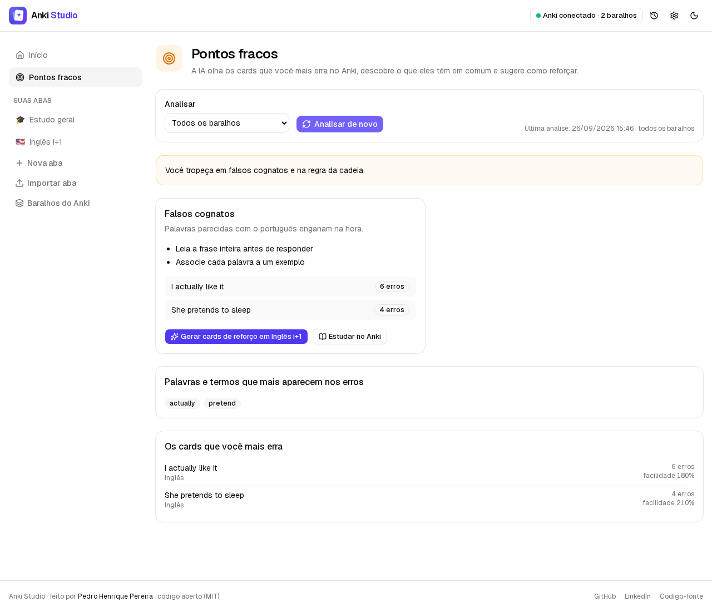
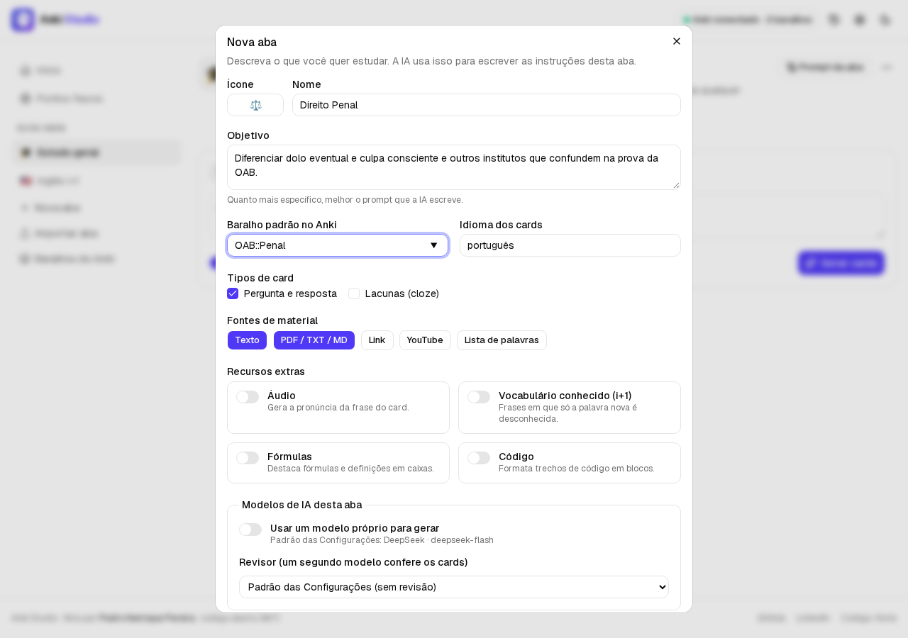
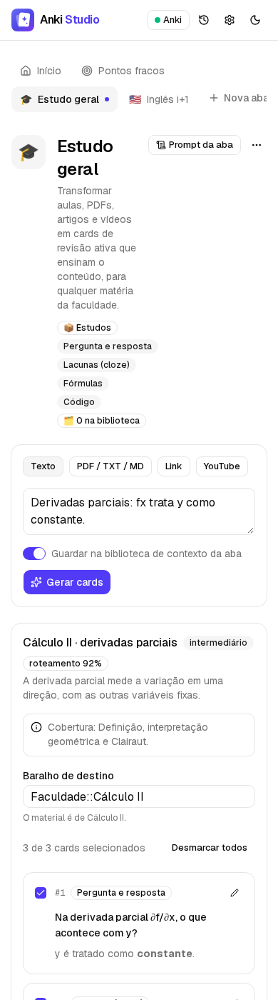
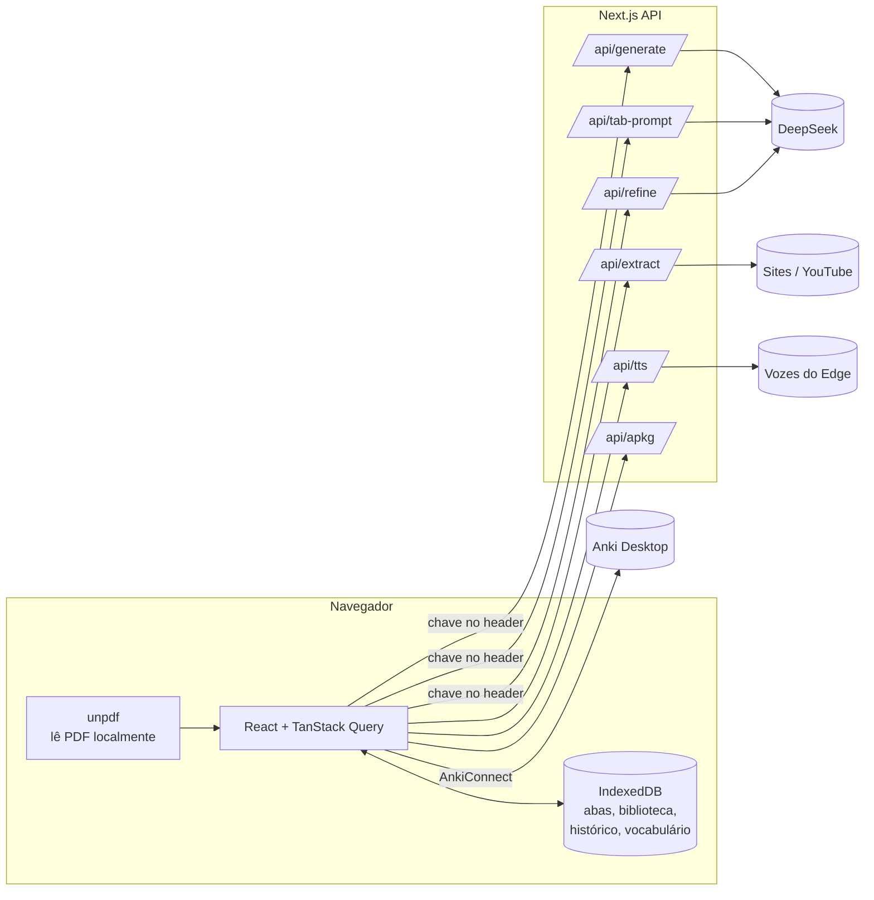
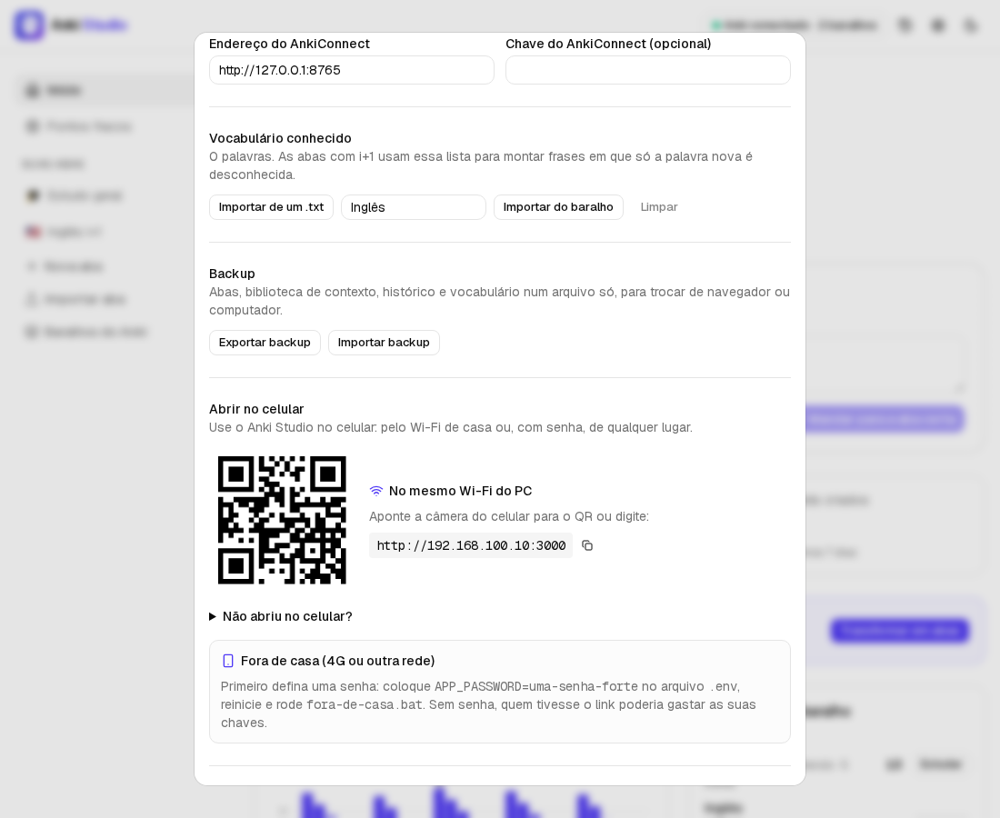
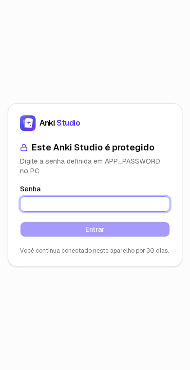

<p align="center"></p>

# Anki Studio

[](https://github.com/pedrohper/Anki-Studio/actions/workflows/ci.yml)


**Flashcards com IA do seu jeito.** Você cria abas de estudo (Cálculo II, Inglês, Direito Penal…), descreve o objetivo de cada uma, e a IA escreve as instruções daquela aba. Funciona com **DeepSeek, OpenAI, Gemini, OpenRouter, Groq, Mistral e Ollama**, e um segundo modelo pode revisar o trabalho do primeiro. Depois é só mandar um PDF, um link, um vídeo do YouTube ou uma lista de palavras: o Anki Studio gera os cards, você revisa um por um e envia direto para o Anki.



## Por que existe

Comecei este projeto para automatizar os meus próprios estudos (faculdade de Sistemas de Informação e inglês). A primeira versão era um script Python com Tkinter e dois modos fixos. Ela funcionava, mas cada matéria nova pedia código novo. Esta versão troca os modos fixos por **abas que a própria pessoa cria**, e cada aba tem um prompt escrito pela IA que melhora conforme o uso.

## O que ele faz

- **Tela Início.** "Boa tarde, Pedro! Você tem 18 flashcards para revisar hoje": o que há em cada baralho, gráfico de revisões dos últimos 30 dias, sequência de dias estudando e atalho para abrir o baralho no Anki.
- **Joga aqui o que você aprendeu.** Na tela Início, cole um texto ou link ou arraste um PDF: a IA descobre a aba certa e já monta os cards lá.
- **Seus baralhos viram abas.** O app lê os baralhos do Anki; cada baralho principal vira uma aba e os sub-baralhos viram destinos dentro dela. A IA lê uma amostra de cada baralho para escrever o objetivo e o prompt da aba.
- **Pontos fracos.** A IA olha os cards que você mais erra no Anki, agrupa por tema, explica o porquê, sugere como estudar e gera cards de reforço de outro ângulo.
- **Não repete o que você já tem.** Antes de gerar, a IA recebe os cards que já existem no baralho de destino para completar lacunas em vez de repetir; repetidos são descartados.
- **Abas personalizadas.** Nome, objetivo, baralho padrão, tipos de card (pergunta/resposta e cloze), idioma, recursos (áudio, vocabulário i+1, fórmulas, código) e fontes de material.
- **A IA escreve o prompt de cada aba.** A partir do objetivo que você descreve. Você pode ver, editar, pedir para reescrever e voltar versões antigas.
- **Escolha a IA.** O guia de configuração mostra para que cada provedor é melhor e quanto custa, e sugere uma combinação pronta (gerar com DeepSeek, revisar com Groq). DeepSeek, OpenAI, Gemini, OpenRouter (centenas de modelos com uma chave), Groq, Mistral ou Ollama no seu PC. Um modelo padrão nas Configurações e troca por aba (ex.: modelo barato para inglês, modelo forte para Cálculo).
- **Um modelo revisa o outro.** Um gera os cards e um segundo modelo, de outro provedor, confere cada um: aponta erro factual, pergunta vaga ou lacuna fraca e propõe a correção. Você aplica ou ignora, card por card ou todas de uma vez.
- **A aba aprende com o uso.** Quando você edita ou descarta cards, a IA analisa esses ajustes e **sugere** uma versão melhor do prompt. Nada muda sem você aceitar.
- **Qualquer material.** Texto, PDF/TXT/MD (lidos no navegador), páginas da web, transcrições do YouTube e listas de palavras. Materiais longos são divididos em partes, sem nada ser cortado em silêncio.
- **Revisão antes de enviar.** Cada card pode ser editado, desmarcado ou ouvido (áudio TTS) antes de ir para o Anki.
- **Envio direto ao Anki** via AnkiConnect, em lote, pulando o que já existe no baralho. Sem Anki aberto? Baixe um **`.apkg`** gerado no servidor.
- **Biblioteca de contexto.** Materiais antigos da aba ajudam a IA a entender termos e conexões dos novos.
- **Inglês i+1.** Frases em que só a palavra nova é desconhecida, com áudio nativo, vários sentidos por palavra e alerta de falsos cognatos.
- **Compartilhar abas.** Exporte uma aba como arquivo e outra pessoa importa.
- **No celular.** O `executar.bat` mostra um QR code com o endereço do PC na rede Wi-Fi, e as Configurações também. Com um link https dá para **instalar como app** e usar o **Compartilhar** do Android: um texto, link ou PDF de outro app cai direto na captura rápida.
- **Fora de casa, com PIN.** Nas Configurações você cria um PIN e liga um link https (Cloudflare Tunnel, grátis e sem conta) com um clique. Sem PIN o botão nem liga, para ninguém gastar as suas chaves com o link.
- **Mesmos dados no PC e no celular.** Rodando no PC, abas, histórico e conquistas ficam em `data/estudio` e todo aparelho que abre o app vê os mesmos dados. No site público cada navegador guarda os seus.
- **Lembrete diário.** Uma notificação no celular no horário que você escolher: "Não quebre sua sequência de 12 dias 🔥 · 42 cards esperando".
- **Direto para o celular.** Depois de enviar cards, o app pede ao Anki do PC para sincronizar com o AnkiWeb, e eles aparecem no AnkiDroid em segundos.
- **Gastos com IA.** Quanto cada provedor já custou por mês, pelos tokens que a própria IA informa.
- **Sem conta, sem banco.** Tudo fica no navegador (IndexedDB), com backup exportável.

No primeiro acesso, um **guia de configuração** acompanha a pessoa: testa a chave da DeepSeek (mostrando o saldo, sem gastar crédito), detecta o Anki ao vivo enquanto ela instala o AnkiConnect, importa backup e vocabulário e ajuda a escolher a primeira aba. Rodando localmente, o que já está configurado no `.env` aparece como pronto.







| Criar uma aba | No celular |
| --- | --- |
|  |  |

## Como funciona



### Decisões técnicas

| Tema | Decisão |
| --- | --- |
| **Vários provedores, um cliente** | Todos os provedores falam o formato da API da OpenAI, então um único cliente atende todos. Cada um aceita parâmetros um pouco diferentes (ex.: modelos de raciocínio recusam `temperature`); se o provedor recusar um parâmetro, a chamada é refeita sem ele. A lista de provedores é fechada: no site público o servidor nunca chama uma URL escolhida pelo visitante. |
| **Dados do Anki** | Painel, pontos fracos e importação de baralhos usam o próprio AnkiConnect (`getDeckStats`, `getNumCardsReviewedByDay`, `findCards` com `prop:lapses>=2 OR rated:30:1`, `cardsInfo`). A IA só recebe texto dos cards, sem HTML, e as respostas dela são validadas: um tema nunca cita um card que não foi enviado, e o roteador nunca escolhe uma aba que não existe. |
| **Gerador + revisor** | O revisor recebe o material original e os cards, devolve um veredito por card (`ok`, `fix`, `remove`) e a correção mínima. A resposta é validada e sanitizada, e correção de cloze sem lacuna é descartada. Aplicar a correção conta como edição, então também alimenta o aprendizado da aba. |
| **Prompt em duas camadas** | O prompt da aba (editável) roda junto com regras fixas do servidor: formato JSON, HTML permitido, fidelidade ao material e defesa contra instruções escondidas no material. Mesmo que alguém escreva qualquer coisa no prompt da aba, a geração não quebra. |
| **Validação ponta a ponta** | Zod valida o corpo de cada rota, a resposta da IA, o que vai para o IndexedDB e os arquivos importados (backup e abas). |
| **Chave do visitante** | Cada pessoa usa as próprias chaves. Elas ficam no navegador e só a do provedor da requisição vai no header; o servidor nunca as guarda nem registra em log. Testar a chave não gasta crédito (saldo da DeepSeek, crédito do OpenRouter ou lista de modelos). Localmente, dá para liberar as chaves do `.env`. |
| **Segurança** | HTML da IA sanitizado no servidor (`sanitize-html`) e de novo no navegador (DOMPurify); proteção contra SSRF na busca de links (bloqueia IPs internos e revalida redirecionamentos); limite de requisições por IP; headers de segurança. |
| **`.apkg` sem Anki** | O pacote é montado com SQLite em WebAssembly (`sql.js`) + zip (`fflate`), no esquema que o Anki importa. IDs estáveis: reimportar não duplica. Testado com o motor oficial do Anki. |
| **AnkiConnect** | No site público, o navegador fala direto com o Anki (é preciso liberar a origem no add-on). Rodando localmente, uma rota de proxy dispensa essa configuração. O envio é em lote, com checagem de duplicatas antes. |
| **Materiais longos** | Divididos em partes por parágrafo e processados em paralelo (3 por vez); os cards são unidos sem repetição. |

### Stack

Next.js 16 (App Router, Route Handlers) · React 19 · TypeScript estrito · Zod 4 · TanStack Query · Tailwind CSS 4 + shadcn/ui (Base UI) · OpenAI SDK (DeepSeek, OpenAI, Gemini, OpenRouter, Groq, Mistral, Ollama) · Vitest · Playwright · Biome · pnpm · GitHub Actions · Docker

## Rodando no seu computador

Pré-requisitos: **Node.js 22+** e **pnpm** (`npm i -g pnpm`).

```bash
git clone https://github.com/pedrohper/Anki-Studio.git
cd Anki-Studio
pnpm install
cp .env.example .env.local   # no Windows: copy .env.example .env.local
```

No `.env.local`, para uso só seu (preencha só as chaves que tiver):

```env
DEEPSEEK_API_KEY=sk-...
OPENAI_API_KEY=
GEMINI_API_KEY=
OPENROUTER_API_KEY=
GROQ_API_KEY=
MISTRAL_API_KEY=
ALLOW_SERVER_KEY=true
ANKI_PROXY_ENABLED=true
OLLAMA_ENABLED=false   # true se tiver o Ollama instalado
```

```bash
pnpm dev          # desenvolvimento em http://localhost:3000
pnpm build && pnpm start   # versão otimizada
```

No Windows também dá para dar dois cliques em **`executar.bat`**: ele instala o que faltar, gera a build e abre o navegador. Depois de atualizar o código, rode `executar.bat --rebuild` para gerar a build de novo.

### Conectando ao Anki

1. No Anki Desktop, instale o add-on **AnkiConnect** (Ferramentas → Complementos → Obter complementos → código `2055492159`) e reinicie.
2. Rodando localmente com `ANKI_PROXY_ENABLED=true`, não precisa de mais nada.
3. Usando o site publicado, libere a origem do site no AnkiConnect (Ferramentas → Complementos → AnkiConnect → Configurar):

```json
"webCorsOriginList": ["http://localhost", "https://seu-site.vercel.app"]
```

O Chrome pode pedir permissão para o site acessar a rede local; é só aceitar. As Configurações do app mostram esse trecho já com o endereço certo.

### Usando no celular

**Mesmo Wi-Fi.** Rode o `executar.bat`: ele mostra o endereço (ex.: `http://192.168.0.10:3000`) e um QR code. O mesmo QR fica em Configurações › Abrir no celular. Se não abrir, deixe a rede do Windows como **Privada** e permita o Node.js no firewall.

**Fora de casa.** Em Configurações › Abrir no celular:

1. Crie um **PIN** (4 a 12 números). A partir daí, todo aparelho novo pede o PIN uma vez (fica conectado por 90 dias).
2. Clique em **Ligar acesso fora de casa**. Na primeira vez o app baixa o `cloudflared` (do GitHub oficial da Cloudflare) para `data/bin`; depois aparece um link `https://….trycloudflare.com` com QR code, que muda cada vez que você liga.
3. **Link fixo (recomendado):** em "Tipo de link", escolha **ngrok**, crie uma conta grátis e cole o token. O endereço passa a ser sempre o mesmo, então o app instalado no celular nunca quebra.

Se o link cair, ele religa sozinho (e confere a cada minuto se continua abrindo). Se estava ligado quando você fechou o app, volta ligado ao abrir. Deixe o PC sem hibernar.

Por baixo: o PIN fica em `data/acesso.json` só como hash (scrypt), com um segredo aleatório que assina os cookies `HttpOnly`; trocar o PIN desconecta todos os aparelhos. O `proxy.ts` bloqueia páginas e API sem sessão, e o login tem limite por IP e trava por 15 min (dobrando a cada vez) depois de 10 erros seguidos, porque um PIN de 4 números tem só 10 mil combinações.

**Como app.** Pelo link https, abra no Chrome do Android › menu › **Instalar app**. O Anki Studio passa a aparecer no **Compartilhar** de outros apps (navegador, YouTube, leitor de PDF). No Wi-Fi (http) o navegador não deixa instalar, mas o site funciona igual.

| Abrir no celular | Tela do PIN |
| --- | --- |
|  |  |

## Deploy

**Vercel:** importe o repositório e pronto. Em produção, deixe `ALLOW_SERVER_KEY=false` (padrão) para cada visitante usar a própria chave, e defina `NEXT_PUBLIC_SITE_URL` com o endereço do site para a prévia do link (imagem em `src/app/opengraph-image.png`) sair certa no LinkedIn.

**Docker:**

```bash
docker build -t anki-studio .
docker run -p 3000:3000 anki-studio
```

> A transcrição do YouTube pode falhar em servidores na nuvem, porque o YouTube costuma bloquear IPs de data centers. Rodando no seu computador funciona normalmente.

## Testes

```bash
pnpm check        # Biome + TypeScript + Vitest
pnpm test:e2e     # Playwright (rode pnpm build antes)
```

- **Vitest (110+ testes):** árvore de baralhos, contas do painel (sequência, dias sem revisão), roteamento e pontos fracos, provedores de IA (chaves, parâmetros por provedor, erros), revisor, geração e divisão de material, normalização dos cards da IA, sanitização, SSRF, rate limit, rotas da API, cliente do AnkiConnect (com tipos de nota em português), montagem do `.apkg`, IndexedDB, backup e compartilhamento de abas.
- **Playwright:** o fluxo completo (gerar → revisar → editar → enviar ao Anki), o guia de configuração inicial, a tela Início, a captura rápida com roteamento, baralhos virando abas, pontos fracos com reforço, a revisão por um segundo modelo, a criação de aba com prompt da IA e a ausência de rolagem horizontal no celular. A IA e o AnkiConnect são simulados, então os testes não gastam crédito.

## Estrutura

```
src/
├── app/                 # páginas e rotas da API (Route Handlers)
│   ├── api/             # generate, review, route, deck-analysis, weak-spots, tab-prompt, refine, models, check-key, extract, tts, apkg, anki, config, network, auth, access
│   ├── entrar/          # tela do PIN
│   ├── compartilhar/    # destino do "Compartilhar" do celular (Web Share Target)
│   └── manifest.ts      # app instalável (PWA)
├── proxy.ts             # exige o PIN quando ele foi criado
├── components/
│   ├── app/             # telas do Anki Studio
│   └── ui/              # componentes shadcn/ui
├── hooks/               # hooks do TanStack Query
└── lib/
    ├── llm/             # registro de provedores de IA (compartilhado)
    ├── schemas/         # schemas Zod compartilhados entre cliente e servidor
    ├── server/          # IA, prompts, .apkg, TTS, extração, segurança
    ├── client/          # AnkiConnect, IndexedDB, backup, leitura de arquivos
    └── shared/          # funções puras (texto, cloze, busca de contexto)
tests/
├── unit/                # Vitest
└── e2e/                 # Playwright
```

## Vindo da versão em Python?

A versão antiga (Tkinter) continua no histórico do Git. Para trazer o vocabulário conhecido, a biblioteca de contexto e o histórico:

```bash
python scripts/migrar-do-python.py data/known_words.db data/backup-app-antigo.json
```

Depois importe o arquivo em **Configurações → Backup → Importar backup**.

## Próximos passos

- Streaming do progresso da geração parte a parte.
- Modo comitê: vários modelos geram em paralelo e um juiz junta os melhores cards.
- Galeria pública de abas compartilhadas (com login).
- Imagens nos cards (diagramas e ocultação de imagem).
- Estatísticas de revisão lidas do próprio Anki.

## Marca

O ícone (dois flashcards e uma faísca de IA) está em `src/app/icon.svg`. Para regenerar a imagem de prévia de links e o ícone do iPhone depois de mudar o SVG: `node scripts/gerar-imagens-da-marca.mjs`.

## Licença

[MIT](LICENSE) © Pedro Henrique Pereira
